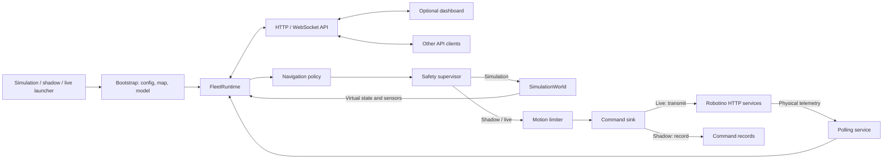

# Architecture and Extension Guide

[Overview](README.md) · [Setup](SETUP.md) · [Run](RUN.md) · [API](API.md) · [Training](TRAINING.md) · Architecture · [Future work](FUTURE_WORK.md)

## Runtime flow

The three launchers select a mode and a model. `bootstrap.py` loads the shared
configuration and map, chooses a navigation controller from the model profile,
and creates one `FleetRuntime`:

Simulation applies commands to `SimulationWorld`. Shadow polls the physical
Robotinos and runs inference but records commands without transmitting them.
Live polls the same physical API and transmits commands. The optional dashboard
uses the same project API as any other client. It visualizes world state and
sends goal and stop requests; navigation decisions remain in Python.

`src/robotino_fleet/` is divided by responsibility:

| Package | Responsibility |
| --- | --- |
| `adapters/robotino/` | HTTP payload parsing, requests, command sinks, and manual keyboard input |
| `execution/` | Physical telemetry polling and callback delivery |
| `domain/` | Robot, pose, sensor, and command state shared across modes |
| `maps/` | Factory map, label, station, and geometry loading |
| `simulation/` | Robotino motion, collisions, obstacles, and simulated sensors |
| `navigation/` | Controller interface, trained-policy inference, goal handover, safety, and motion limiting |
| `learning/` | RL observations, environments, rewards, model contracts, PPO, and evaluation |
| `api/` | HTTP/WebSocket control and telemetry interface for clients |

The model proposes motion; `NavigationSafetySupervisor` and `MotionLimiter`
remain outside the learned policy. A goal is a factory label. Once its position
tolerance is reached, the deterministic handover aligns the Robotino when the
label defines a heading. Station approach labels report `READY_TO_DOCK` for
the factory's docking workflow; other labels report `ARRIVED`.

## Coordinates and model contracts

`/data/pose` arrives in the indoor-tracking frame. The transform in
`config/localization.yaml` converts it to the factory-map frame before
`FleetRuntime` receives a `PoseObservation`. `/data/odometry` has its own local
origin and is not interchangeable with a factory-map position. Navigation
commands are body-frame `[vx, vy, omega]`.

A trained policy has a `.zip` artifact and, for local-target policies, a
matching `.profile.json` sidecar. The profile defines sensor normalization,
observation shape, action meaning, policy period, and handover behavior.
`learning/profile.py` validates supported versions; `learning/observation.py`
builds the same observation in training and inference. Runtime loading rejects
incompatible observation or action spaces. SB3 and custom recurrent GRU
artifacts share the runtime controller interface but have different archive
internals.

## Where to extend the project

- **Another Robotino:** add its IP, simulation start label, and LiDAR extrinsic
  to `config/robotinos.yaml`. The IP is its identity throughout backend and UI.
  Calibrate the shared map transform before physical navigation.
- **Another trained model using an existing contract:** train and evaluate it,
  retain the model/profile pair, and change `MODEL_PATH` in the desired launcher.
  No mode-specific controller rewrite is required.
- **A new policy or observation contract:** define its profile validation in
  `learning/profile.py`, construct matching observations in
  `learning/observation.py`, and implement or select a `NavigationController` in
  `navigation/`. Register its action mode in `bootstrap.py`, then add training,
  evaluation, and contract tests. Keep model-specific architecture and training
  parameters visible in its experiment script.
- **A new physical sensor:** parse its HTTP payload in
  `adapters/robotino/http_api.py`, poll it in `execution/polling.py`, add its
  state to `domain/models.py`, and simulate the equivalent in `simulation/`.
  Only then add it to an observation profile and retrain. If displayed, expose
  it in the world-state API and `frontend/src/types/fleet.ts` as well. The same
  safety input must have the same physical-versus-virtual meaning in every
  mode.
- **Another map fixture:** supply `navigation-map.yaml`,
  `navigation-map.pgm`, `positions.lisp`, `stations.lisp`, and
  `environment-geometry.yaml` under `data/maps/`. Point `config.py` at that
  bundle, provide a display image under `data/generated/`, and update the
  fixture metadata and image route in `maps/loader.py` and `api/app.py`.
  Verify coordinates, physical clearances, and the dashboard together. Map
  swapping is an explicit code change, not a runtime dropdown.

See [Future work](FUTURE_WORK.md) for development directions built on this
architecture.
